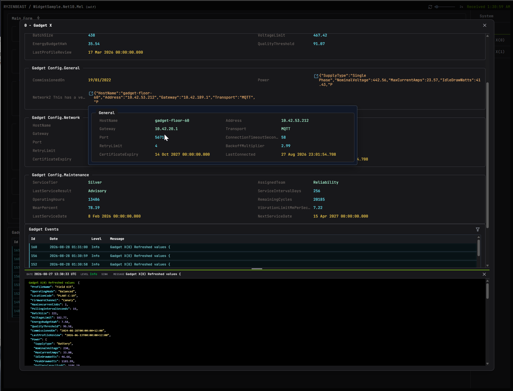

# DiagnosticExplorer

Add live diagnostic data to a .NET application, then inspect it in a browser.

## Dashboard

[](docs/dashboard.png)

Inspect registered objects, their properties, and live diagnostic events from one browser view.

## Quick Start

This package adds configuration-based Diagnostic Explorer hosting:

```xml
<PackageReference Include="DiagnosticExplorer.Hosting" Version="5.0.0" />
```

This `appsettings.json` section enables a local viewer and a remote-service
connection. Use either host or both, and tune retention without changing code:

```json
{
  "DiagnosticExplorer": {
    "Enabled": true,
    "Hosts": [
      { "Type": "SelfHost", "Url": "http://127.0.0.1:50001" },
      { "Type": "Remote", "Url": "http://localhost:50000/diagnostics" }
    ],
    "EventRetention": {
      "MaxEventsPerSink": 1000,
      "MaxAgeMinutes": 30
    },
    "LogEventRetention": {
      "MaxEvents": 5000,
      "MaxAgeMinutes": 5
    }
  }
}
```

This generic-host setup reads the host configuration, starts the selected
hosts, registers diagnostic objects, and configures their presentation:

```csharp
using DiagnosticExplorer;
using Microsoft.Extensions.DependencyInjection;
using Microsoft.Extensions.Hosting;

HostApplicationBuilder builder = Host.CreateApplicationBuilder(args);

builder.Services.AddSingleton<WidgetService>();
builder.Services.ConfigureDiagnosticExplorer(
    builder.Configuration,
    diagnostics =>
    {
        diagnostics.RegisterObjects(RegisterObjects);
        ConfigureClasses(diagnostics);
        ConfigureEventRoutes(diagnostics);
    }
);

await builder.Build().RunAsync();
```

`RegisterObjects` runs when diagnostics are collected. Resolve an application
service, then register the dynamic objects it owns:

```csharp
private static void RegisterObjects(IDiagRegistrar registrar)
{
    WidgetService widgetService = registrar.GetRequiredService<WidgetService>();

    registrar.RegisterService<WidgetService>("Application", "Widget service");
    foreach (Widget widget in widgetService.Widgets)
        registrar.Register(widget, "Widgets", widget.Name);
}
```

`RegisterService<T>` resolves `T` from the application service provider before
registering it. Use it for long-lived services, typically singletons.
`Register` remains available for objects created at runtime.

Without a type profile, Diagnostic Explorer displays public scalar properties,
collection counts, and complex values as drilldown icons. A type profile lets
you start small and make the display intentional. This is a good first profile:

```csharp
private static void ConfigureClasses(IDiagConfigurator diagnostics)
{
    diagnostics.Configure<Widget>(options =>
    {
        options.ExcludeAll();

        options.Property(widget => widget.Name)
            .WithLabel("Widget name")
            .AllowSet();
        options.Property(widget => widget.Status);
    });
}
```

`ExcludeAll()` starts with an empty display, then each `Property(...)` adds one
row. Use `IncludeAll()` when the default public-property view is closer to what
you need. `WithLabel(...)` changes only the text users see; it does not change
which property is read. `AllowSet()` makes a writable property editable in the
viewer.

### Organize properties

Add `Category(...)` when a group makes the display easier to scan. Properties
without a category appear at the top of the view, so there is no need to create
a catch-all category such as `General`.

```csharp
diagnostics.Configure<Widget>(options =>
{
    options.ExcludeAll();

    options.Property(widget => widget.Name).WithLabel("Widget name");
    options.Property(widget => widget.Status).WithCategory("Health");
    options.Property(widget => widget.LastUpdated)
        .WithLabel("Last updated")
        .WithCategory("Health")
        .ShowElapsed();
});
```

### Show nested details

Use `Expand()` to place an object's properties directly in the current view.
First-level expanded sections start open by default. Pass `false` when the
details should start collapsed.

```csharp
diagnostics.Configure<Widget>(options =>
{
    options.Property(widget => widget.Connection)
        .WithLabel("Connection")
        .Expand(initiallyExpanded: false)
        .WithExpandedHover();
});
```

`WithExpandedHover()` opens the same nested details on hover. It is useful when
you want the main display compact but still need quick inspection.

### Configure collections

For supported collection properties, `Property(...)` shows a count by default.
Choose one of the collection outputs to show the items instead:

```csharp
diagnostics.Configure<Widget>(options =>
{
    options.Property(widget => widget.Components)
        .WithLabel("Components")
        .WithCategory("Inventory")
        .ListItems()
        .WithListItemName(component => component.Name)
        .WithListItemValue(component => component.Status)
        .WithMaxItems(50)
        .WithDrillDown();

    options.Property(widget => widget.Tags)
        .WithCategory("Inventory")
        .ConcatItems(", ")
        .WithTextWrap();
});
```

`ListItems(...)` gives each item its own row. `ConcatItems(...)` creates one
compact text value. `ExpandItems(item => item.Id)` creates an expanded section
for the collection, then an item section for each value with that item's
diagnostic properties. Its selector must produce a distinct label for every
item; include an identifier when a readable name alone is not unique. Pass
`initiallyExpanded: false` when the collection should start collapsed:

```csharp
options.Property(widget => widget.Gadgets)
    .ExpandItems(gadget => gadget.FullName, initiallyExpanded: false);
```

Chain `WithPrimaryPropertiesOnly()` after `ExpandItems(...)` or `Expand()` to
show only direct, uncategorized properties. Nested `Expand()` and `Custom()`
sections are omitted, keeping the expanded section focused on primary values.

`WithMaxItems(...)` limits list, category, and concatenated outputs; the viewer
shows how many items were omitted. `WithTextWrap()` lets a concatenated value
wrap instead of cutting it off.

Arrays, the common collection interfaces, `List<T>`, `HashSet<T>`,
`ObservableCollection<T>`, and `BindingList<T>` are supported. Dictionaries
are also supported and display key/value pairs.

### Group derived diagnostics

Use `Custom(...).Expand()` to group derived properties in an expandable main
view section. The projection may include a collection output:

```csharp
options.Custom("Gadgets", projection =>
{
    projection.Property("All gadgets", form => form.Gadgets)
        .ExpandItems(gadget => gadget.FullName);
}).Expand();
```

The `Gadgets` section contains the generated item sections directly; an
`ExpandItems(...)` member does not add another collection section inside an
expanded custom projection. This is useful when the group is diagnostic-only
rather than a property on the application type.

### Drill into a value

`WithDrillDown()` makes a complex value, collection item, or custom property
interactive while keeping its rendered value. Use `WithDrillDownOnly()` to show
only a `[show more]` text value, or pass a custom string instead.

```csharp
diagnostics.Configure<Widget>(options =>
{
    options.Property(widget => widget.Configuration)
        .WithDrillDown(maxItems: 50);

    options.Property("Connection snapshot", widget => new
        {
            widget.Connection.Endpoint,
            widget.Connection.IsConnected,
        })
        .WithDrillDownOnly("View connection");
});

diagnostics.ConfigureDrillDown<WidgetConfiguration>(options =>
{
    options.ExcludeAll();
    options.Property(instance => instance.Status);
    options.Property(instance => instance.Owner).WithDrillDown();
});
```

`ConfigureDrillDown<T>(...)` controls what appears in that overlay. If you do
not add a drilldown profile, Diagnostic Explorer reuses the normal type profile.
Drilldowns are not shown for null values or empty collections.

Use `Property("name", value)` for a named or computed property. `AsJson()`
with `WithJsonHover()` fetches JSON only when users hover over the value.

### Private fields and anonymous objects

Use a named delegate property to expose computed or private state. Write the
configuration inside the declaring type when it needs private-field access:

```csharp
private static void ConfigureDiagnostics(IDiagConfigurator diagnostics)
{
    diagnostics.Configure<Widget>(options =>
    {
        options.Property("Retry count", widget => widget._retryCount).WithCategory("Internal");
        options.Property("Last error", widget => widget._lastError?.Message).WithCategory("Internal");
    });
}
```

For `DateTime` and `DateTimeOffset` values, date display options are available
directly from `Property`:

```csharp
options.Property(widget => widget._lastUpdated).ShowElapsed();
options.Property("Last updated", widget => widget._lastUpdated).ShowDate(false).ShowElapsed();
```

For `RateCounter` values, configure rate and total displays the same way:

```csharp
options.Property(widget => widget._requests).ShowRate(false).ShowTotal();
options.Property("Background requests", widget => widget._backgroundRequests).ShowTotal();
```

Return an anonymous object for a small, read-only diagnostic snapshot. Its
generated public properties render in the drilldown view:

```csharp
options.Property(
        "Connection snapshot",
        widget => new
        {
            widget.Connection.Endpoint,
            widget.Connection.IsConnected,
        }
    )
    .WithDrillDownOnly("View connection");
```

The [widget sample configuration](samples/WidgetSample.Harness/Form1.cs) has
more examples of custom properties, collection outputs, warnings, and errors.
For an agent-focused, end-to-end integration guide, see
[configuring Diagnostic Explorer in an application](Docs/agent-configuration-guide.md).

This helper routes events from named loggers to separate event sinks. Each
integration below uses these same routes:

```csharp
private static void ConfigureEventRoutes(IDiagConfigurator diagnostics)
{
    diagnostics.ConfigureEventRouting(routes =>
        routes
            .UseMatchMode(EventSinkRouteMatchMode.AllMatches)
            .Route("Widgets", route => route.AtLeast(LogLevel.Information).To("Widgets", "Widget Events"))
            .Route("Gadgets", route => route.AtLeast(LogLevel.Warning).To("Gadgets", "Gadget Warnings"))
            .Route("*", route => route.AtLeast(LogLevel.Error).To("System", "Errors")));
}
```

For an application without a generic host, create the configuration, register
objects directly, and start the configured hosts yourself:

```csharp
using DiagnosticExplorer;

DiagnosticConfiguration diagnostics = DiagnosticManager.Configure(config =>
{
    config.ConfigureHosting(applicationConfiguration);
    config.RegisterObjects(registrar => registrar.Register(widget, "Widgets", "Widget 42"));
    ConfigureClasses(config);
    ConfigureEventRoutes(config);
});

await DiagnosticHostingService.StartAsync(diagnostics);
try
{
    RunApplication();
}
finally
{
    await DiagnosticHostingService.Stop();
}
```

Run the application and open the configured `SelfHost` URL in a browser. For a
`Remote` host, run `DiagnosticService`, open its configured URL, and select
your registered application.

## Download

[Download the latest DiagnosticService Windows Service installer](https://github.com/cell001nz/diagnostic-explorer/releases/latest/download/DiagnosticExplorer.Service-win-x64.msi).

## Microsoft.Extensions.Logging

This optional package forwards `Microsoft.Extensions.Logging` events to
Diagnostic Explorer:

```xml
<PackageReference Include="DiagnosticExplorer.Extensions.Logging" Version="5.0.0" />
```

This registers the logging provider after `ConfigureDiagnosticExplorer`:

```csharp
using DiagnosticExplorer;
using DiagnosticExplorer.Extensions.Logging;
using Microsoft.Extensions.Logging;

services.AddLogging(logging => logging.AddDiagnosticExplorer());
```

The provider sends matching `Microsoft.Extensions.Logging` events to Diagnostic
Explorer, including structured properties:

```csharp
logger.LogInformation("Processed {WidgetCount} widgets", widgetCount);
```

## NLog

This package adds a Diagnostic Explorer target to NLog:

```xml
<PackageReference Include="DiagnosticExplorer.NLog" Version="5.0.0" />
```

This configuration sends NLog events through the routes configured above:

```csharp
using DiagnosticExplorer.NLog;
using NLog;
using NLog.Config;

LoggingConfiguration logging = new();
logging.AddDiagnosticExplorer();
LogManager.Configuration = logging;
```

NLog templates retain their event properties:

```csharp
logger.Info("Processed {WidgetCount} widgets", widgetCount);
```

## Serilog

This package adds a Diagnostic Explorer sink to Serilog:

```xml
<PackageReference Include="DiagnosticExplorer.Serilog" Version="5.0.0" />
```

This configuration sends Serilog events through the routes configured above:

```csharp
using DiagnosticExplorer.Serilog;
using Serilog;

using ILogger logger = new LoggerConfiguration()
    .MinimumLevel.Verbose()
    .WriteTo.DiagnosticExplorer()
    .CreateLogger();
```

Serilog properties are forwarded with the event:

```csharp
logger.Information("Processed {WidgetCount} widgets", widgetCount);
```
