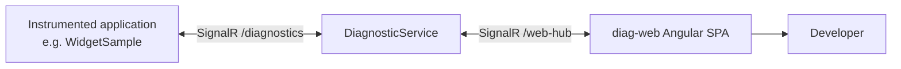

# DiagnosticExplorer

DiagnosticExplorer is a .NET diagnostic instrumentation toolkit and a
web-based viewer for inspecting live application state. The
`DiagnosticService` hosts the `diag-web` Angular single-page application
and exposes SignalR endpoints for both diagnostic clients and the browser.
Applications such as `WidgetSample` connect to the service, register
themselves, and keep a live connection open while they publish
diagnostic data.

The Angular dashboard shows the programs currently registered with the
service. A developer can select a program to request and inspect its
diagnostic information, including the property bags, operations, and
events made available by the application.

The project originated as Cameron Elliot's open-source diagnostic
toolset around 2010 (LGPL v3+) and has been carried forward under
Centerprise's EMS trading platform as the diagnostic backbone for the
TOMI engine and its surrounding services.

## How it works



1. An instrumented application uses `DiagnosticExplorer.Hosting` to
   connect to the `DiagnosticService` endpoint at `/diagnostics`.
2. The application registers with the service and maintains its SignalR
   connection while it is running.
3. `diag-web` connects to the service's `/web-hub` endpoint and displays
   the registered applications.
4. Selecting an application in the dashboard requests its current
   diagnostics and presents the response for inspection.

## Running the viewer locally

The service and SPA are deployed together in normal use. Before starting
`DiagnosticService`, set its `DiagServiceSettings` configuration to point
to the built Angular output and the URLs on which the service should
listen. The base configuration is in
`DiagnosticService/Config/settings.json`; environment-specific transforms
can supply the deployment values.

Build the SPA from `diag-web`:

```bash
npm install
npm run build
```

Then run the service from the repository root:

```bash
dotnet run --project DiagnosticService/Diagnostic.Service.csproj
```

For UI development, start the Angular development server instead:

```bash
cd diag-web
npm start
```

Set `DiagServiceSettings:UseSpaProxy` and `DiagServiceSettings:SpaProxy`
for the Angular development server when using this mode. The service
will proxy SPA requests while continuing to host the SignalR endpoints.

## Repository layout

```
DiagnosticExplorer/          netstandard2.0 core library
                             - PropertyBag, TraceScope, OperationSet,
                               protobuf transport types, log4net forwarding
DiagnosticExplorer.Hosting/  net8.0 / net6.0 / net48 hosting integration
                             - AddDiagnosticExplorer DI extension,
                               DiagnosticHostingService, RegistrationHandler
DiagnosticService/           Standalone ASP.NET Core viewer service
                             - SignalR hubs at /diagnostics and /web-hub
                             - Hosts the SPA or proxies to its dev server
diag-web/                     Angular SPA for browsing registered programs
                             - Select a program to view live diagnostics
WidgetSample/                WinForms diagnostic-client example
                             - Registers with the service and publishes data
ConsoleApp/                  Smaller CLI demo
```

## Using the library

Add the package reference:

```xml
<PackageReference Include="DiagnosticExplorer.Hosting" Version="3.1.38" />
```

Wire into a `Host.CreateDefaultBuilder` pipeline:

```csharp
services.AddDiagnosticExplorer(context.Configuration);
```

For SignalR connections that need custom configuration (e.g. an Azure
AD bearer token), pass an `Action<HttpConnectionOptions>`:

```csharp
services.AddDiagnosticExplorer(
    context.Configuration,
    options => options.AccessTokenProvider = GetCurrentAccessToken);
```

Static start (for non-DI hosts):

```csharp
DiagnosticHostingService.Start(
    "http://diagnostics:2803/diagnostics",
    options => options.AccessTokenProvider = GetCurrentAccessToken);
```

Required configuration:

```json
{
  "DiagnosticExplorer": {
    "Uri": "http://diagnostics:2803/diagnostics",
    "Enabled": true
  }
}
```

The `Uri` may be a comma-or-semicolon-separated list of hub URLs if you
want a single application to report to multiple diagnostic servers.
