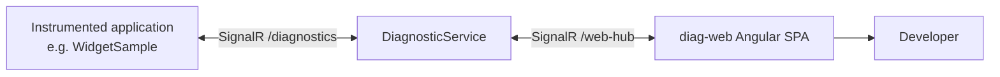

# DiagnosticExplorer

DiagnosticExplorer is a .NET diagnostic instrumentation toolkit and a
web-based viewer for inspecting live application state. The
`DiagnosticService` hosts the `diag-web` Angular single-page application
and exposes SignalR endpoints for both diagnostic clients and the browser.
Applications such as `WidgetSample` connect to the service, register
themselves, and keep a live connection open while they publish
diagnostic data.

The Angular dashboard shows the programs currently registered with the
service. A developer can select a program to request and inspect its
diagnostic information, including the property bags, operations, and
events made available by the application.

The project originated as Cameron Elliot's open-source diagnostic
toolset around 2010 (LGPL v3+) and has been carried forward under
Centerprise's EMS trading platform as the diagnostic backbone for the
TOMI engine and its surrounding services.

## How it works



1. An instrumented application uses `DiagnosticExplorer.Hosting` to
   connect to the `DiagnosticService` endpoint at `/diagnostics`.
2. The application registers with the service and maintains its SignalR
   connection while it is running.
3. `diag-web` connects to the service's `/web-hub` endpoint and displays
   the registered applications.
4. Selecting an application in the dashboard requests its current
   diagnostics and presents the response for inspection.

## Self-host a local viewer

`DiagnosticExplorer.SelfHost` serves a realtime-only Angular viewer from the
instrumented process itself. It connects directly to that process and does
not register with or depend on `DiagnosticService`. Use it for a console app,
worker, desktop app, or service that needs a local inspection endpoint.

The package targets `net8.0` and `net48`:

| Target   | Standalone host     | Existing host integration | Server transport     |
| -------- | ------------------- | ------------------------- | -------------------- |
| `net8.0` | Yes                 | ASP.NET Core/Kestrel      | ASP.NET Core SignalR |
| `net48`  | Yes, root path only | No                        | OWIN/SignalR 2       |

The Angular viewer is embedded in the package, so consumers do not need
Node.js or a separate web application deployment.

### Standalone hosting

Use standalone hosting when the application does not already own an HTTP
pipeline:

```xml
<PackageReference Include="DiagnosticExplorer.SelfHost" Version="3.1.38" />
```

```csharp
using DiagnosticExplorer.SelfHost;

using DiagnosticSelfHost host = await DiagnosticSelfHostingService.StartAsync(
    configuration);

Console.WriteLine($"Open {host.Url} in a browser.");
```

Configure the standalone local listener with `DiagnosticExplorer:SelfHostUrl`. Set `DiagnosticExplorer:Enabled` to `false` to disable diagnostic object registration, event-sink writes, and diagnostic hosting:

```json
{
  "DiagnosticExplorer": {
    "Enabled": true,
    "SelfHostUrl": "http://127.0.0.1:1234"
  }
}
```

The default URL is `http://127.0.0.1:1234`. Disposing the returned
`DiagnosticSelfHost`, or calling `StopAsync`, stops the listener and releases
the diagnostic subscriptions created by the viewer. A path base can be
configured for modern targets:

```csharp
using DiagnosticSelfHost host = await DiagnosticSelfHostingService.StartAsync(
   "http://127.0.0.1:1234",
   new SelfHostOptions { PathBase = "/diagnostics" });
```

The viewer is then available at `/diagnostics/` beneath the listener URL.

### Existing ASP.NET Core hosting

An ASP.NET Core application can keep ownership of its URLs, authentication,
CORS policy, and shutdown lifecycle:

```csharp
using DiagnosticExplorer.SelfHost;

builder.Services.AddDiagnosticSelfHost(builder.Configuration, options =>
{
  options.PathBase = "/diagnostics";
});

var app = builder.Build();
app.MapDiagnosticSelfHost();
```

The local SignalR hub is at `/diagnostics/hub`, while the browser should use
`/diagnostics/`. The self-host viewer exposes one local process and supports
property inspection and edits, parameterless diagnostic operations, and live
event streaming. It does not provide the multi-process selector, Retro
diagnostics, or persistence features available through `DiagnosticService`.

Bind to loopback by default. The viewer can expose object state and invoke
diagnostic operations, so any non-loopback deployment must provide
application-specific authentication, authorization, and transport security;
the package does not add those protections itself. See
[SELF_HOST.md](SELF_HOST.md) for the complete integration and security guide.

## Running the viewer locally

The service and SPA are deployed together in normal use. Before starting
`DiagnosticService`, set its `DiagServiceSettings` configuration to point
to the built Angular output and the URLs on which the service should
listen. The base configuration is in
`DiagnosticService/Config/settings.json`; environment-specific transforms
can supply the deployment values.

Build the SPA from `diag-web`:

```bash
npm install
npm run build
```

Then run the service from the repository root:

```bash
dotnet run --project DiagnosticService/Diagnostic.Service.csproj
```

For UI development, start the Angular development server instead:

```bash
cd diag-web
npm start
```

Set `DiagServiceSettings:UseSpaProxy` and `DiagServiceSettings:SpaProxy`
for the Angular development server when using this mode. The service
will proxy SPA requests while continuing to host the SignalR endpoints.

## Repository layout

```
DiagnosticExplorer/          netstandard2.0 core library
- PropertyBag, TraceScope, OperationSet, protobuf transport types
DiagnosticExplorer.Log4Net/  netstandard2.0 log4net integration package
- Configurable diagnostic and resilient appenders
DiagnosticExplorer.Hosting/  net8.0 / net48 hosting integration
- AddDiagnosticExplorer DI extension, DiagnosticHostingService, RegistrationHandler
DiagnosticExplorer.SelfHost/ net8.0 / net48 local diagnostics viewer
- Kestrel or OWIN host plus embedded Angular SPA
DiagnosticService/           Standalone ASP.NET Core viewer service
- SignalR hubs at /diagnostics and /web-hub
- Hosts the SPA or proxies to its dev server
diag-web/                     Angular SPA for browsing registered programs
- Select a program to view live diagnostics
WidgetSample/                WinForms diagnostic-client example
- Registers with the service and publishes data
ConsoleApp/                  Smaller CLI demo
SelfHostSample/              Standalone local-viewer console sample
```

## Publishing NuGet packages

The [NuGet publishing workflow](.github/workflows/publish-nuget-packages.yml)
publishes release packages on `v*.*.*` tags or through manual dispatch. It
uses NuGet trusted publishing and does not require a stored API key.

Before its first run, create a NuGet.org trusted-publishing policy with:

- Repository owner: `cell001nz`
- Repository: `diagnostic-explorer`
- Workflow file: `publish-nuget-packages.yml`
- Environment: leave empty

The workflow uses the NuGet.org profile name `cell001uk`. Update the `user`
value in the workflow if the package-owning NuGet.org profile has a different
name.

## Using the library

Add the package reference:

```xml
<PackageReference Include="DiagnosticExplorer.Hosting" Version="3.1.38" />
```

To forward log4net events to DiagnosticExplorer, add the optional integration
package and configure its appenders in `log4net.config`:

```xml
<PackageReference Include="DiagnosticExplorer.Log4Net" Version="3.1.38" />
```

Use the `DiagnosticExplorer.Log4Net` assembly in appender type names, for
example:

```xml
<appender name="Diagnostics" type="DiagnosticExplorer.Log4Net.DiagnosticAppender, DiagnosticExplorer.Log4Net" />
```

Wire into a `Host.CreateDefaultBuilder` pipeline:

```csharp
services.AddDiagnosticExplorer(context.Configuration);
```

For SignalR connections that need custom configuration (e.g. an Azure
AD bearer token), pass an `Action<HttpConnectionOptions>`:

```csharp
services.AddDiagnosticExplorer(
    context.Configuration,
    options => options.AccessTokenProvider = GetCurrentAccessToken);
```

Static start (for non-DI hosts):

```csharp
DiagnosticHostingService.Start(
    "http://diagnostics:2803/diagnostics",
    options => options.AccessTokenProvider = GetCurrentAccessToken);
```

Required configuration:

```json
{
  "DiagnosticExplorer": {
    "RemoteUrl": "http://diagnostics:2803/diagnostics"
  }
}
```

The `Uri` may be a comma-or-semicolon-separated list of hub URLs if you
want a single application to report to multiple diagnostic servers.
