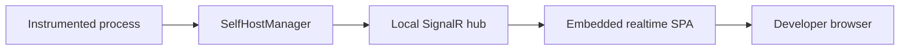

# Self-Hosted Diagnostics

`DiagnosticExplorer.SelfHost` is implemented as a multi-targeted package with
a realtime-only Angular viewer embedded in the assembly. This guide describes
the current integration surface and its intentional limits.

`DiagnosticExplorer.SelfHost` lets an instrumented application host a realtime diagnostics viewer for itself. Unlike the existing `DiagnosticService` mode, the application does not register with a central service or connect to another process. A developer opens a local browser URL to inspect the process that owns the viewer.

## When To Use It

Use self-hosting for local development, support investigations, or a focused single-process diagnostic view. Use `DiagnosticService` when multiple running applications must register with one viewer or when historical diagnostics are required.

| Capability                        | `DiagnosticService`            | `DiagnosticExplorer.SelfHost` |
| --------------------------------- | ------------------------------ | ----------------------------- |
| Processes shown                   | Many remote or local processes | One local process             |
| Process selector                  | Yes                            | No                            |
| Realtime diagnostics              | Yes                            | Yes                           |
| Property edits and operations     | Yes                            | Yes                           |
| Event streaming                   | Yes                            | Yes                           |
| Retro diagnostics and persistence | Yes                            | No                            |
| Remote registration               | Yes                            | No                            |

## Architecture



`SelfHostManager` is the boundary between the browser and the process. It uses `DiagnosticManager` directly to request diagnostic state, change properties, execute operations, and stream events. It presents one stable local process identity to every connected browser client.

The self-host package must not use `DiagnosticHostingService` or `RegistrationHandler`. It must not register with `DiagnosticService`, forward diagnostic messages, or persist Retro data.

## Package And Framework Support

The package is `DiagnosticExplorer.SelfHost` and targets `net8.0` and `net48`.

| Target   | Standalone integration | Existing web-host integration | Server transport     |
| -------- | ---------------------- | ----------------------------- | -------------------- |
| `net8.0` | Yes                    | Yes, ASP.NET Core/Kestrel     | ASP.NET Core SignalR |
| `net48`  | Yes, root path only    | Not in the first release      | OWIN and SignalR 2   |

A .NET Framework 4.8 application can use the ASP.NET Core SignalR _client_, but it cannot host an ASP.NET Core SignalR hub in-process. The `net48` package implementation will therefore use OWIN and SignalR 2 behind the same public self-host API.

ASP.NET Core SignalR and SignalR 2 have incompatible browser protocols. The realtime UI shares its screen and state model, while the package carries a transport-specific SPA bundle for each server implementation.

## Typed .NET SignalR Clients

Use `TypedSignalR.Client` for .NET clients that connect to an ASP.NET Core SignalR hub. It generates strongly typed hub proxies and callback registrations from shared interfaces, replacing string-based `InvokeAsync` and `On` calls with compile-time checked methods.

`IDiagnosticHubServer` and `IDiagnosticHubClient` already use the required `Task` and `Task<T>` method shapes. `RegistrationHandler` should therefore replace its manual `HubServerAdapter` calls with a typed `IDiagnosticHubServer` proxy, and register an `IDiagnosticHubClient` receiver on the connection. The realtime-only self-host contracts should follow the same pattern for modern .NET integration tests and any .NET viewer clients.

This package applies only to the ASP.NET Core SignalR client protocol. The `net48` OWIN self-host branch uses SignalR 2 and needs its own adapter; `TypedSignalR.Client` does not bridge those incompatible server protocols.

## Standalone API

The standalone API is intended for console applications, workers, Windows services, and WinForms applications that do not already own an HTTP listener:

```csharp
using DiagnosticSelfHost diagnostics = await DiagnosticSelfHostingService.StartAsync(
        configuration);
```

`StartAsync` returns a host handle. `StopAsync` waits for the listener and diagnostic subscriptions to stop. `Dispose` initiates that same cleanup without blocking the calling thread, which makes it safe to call from a UI shutdown handler. Starting an equivalent listener twice must fail clearly; disposal and stop operations must be safe to repeat.

Configure the standalone listener with `DiagnosticExplorer:SelfHostUrl`. Set `DiagnosticExplorer:Enabled` to `false` to disable all diagnostic registration, event writes, and hosting:

```json
{
  "DiagnosticExplorer": {
    "Enabled": true,
    "SelfHostUrl": "http://127.0.0.1:1234"
  }
}
```

`SelfHostOptions` configures the path base and detailed hub errors. `PathBase`
is supported by modern ASP.NET Core hosting; standalone net48 OWIN hosting uses
the root path only. The default bind address is loopback-only. The package
embeds the SPA assets; consumers do not install Node.js or build Angular files.

For applications that already own an ASP.NET Core pipeline, the package provides registration and endpoint-mapping extensions instead of creating a second Kestrel server:

```csharp
builder.Services.AddDiagnosticSelfHost(builder.Configuration, options =>
{
  options.PathBase = "/diagnostics";
});

var app = builder.Build();
app.MapDiagnosticSelfHost("/diagnostics");
```

Mapping preserves ownership of the host application's URLs, startup and shutdown, authentication, CORS policy, routing, and fallback routes. The self-host middleware maps its assets and hub only beneath its configured path base.

## Browser Contract

The hub exposes only realtime operations:

- `Subscribe` and `Unsubscribe` for the one local process.
- `SetProperty` and `ExecuteOperation` for interactive diagnostics.
- Callbacks for diagnostic responses, response errors, initial events, and streamed events.

The browser client passes the local process ID for protocol consistency. The server validates that it is the single process exposed by this host and returns an `OperationResponse` error for another ID, invalid diagnostic paths, or invalid operation arguments.

The intended endpoint shape is scoped to the configured path base. With a path base of `/diagnostics`, the viewer is available at `/diagnostics/` and the hub at `/diagnostics/hub`. Consumers should use the viewer URL rather than relying on hub route details.

## Reusable Angular Viewer

`diag-web` contains a dedicated `self-host` Angular entry point. It uses a
transport adapter so the same realtime screen can connect to ASP.NET Core
SignalR or the SignalR 2 hub used by net48.

The following remain specific to the full `DiagnosticService` application:

- The registered-process list and route-based process selection.
- Multi-process state and navigation.
- All Retro search, persistence, and result components.
- The existing `/web-hub` transport adapter.

The self-host shell supplies a fixed local process and has no selector or Retro
route. It displays property bags and live events, supports editable properties,
and can execute parameterless bag operations. Operations with parameters remain
available through the hub but are intentionally not presented by the compact UI.

## Security And Exposure

The viewer can expose object state and invoke diagnostic operations. It is therefore a local development/support tool by default.

- Bind to loopback by default, such as `http://127.0.0.1:1234`.
- Do not bind to all network interfaces unless the caller explicitly chooses to do so.
- A non-loopback deployment must provide application-specific authentication, authorization, and transport security before exposing the viewer. The package does not add authentication itself.
- Existing ASP.NET Core hosts retain their own authentication and CORS policy; the package must not add permissive global defaults.

## Build The Viewer

The package includes the compiled assets under
`DiagnosticExplorer.SelfHost/wwwroot`. Regenerate them after editing the
self-host Angular source:

```bash
npm --prefix diag-web run build:self-host
npm --prefix diag-web run build:self-host-net48
```

Copy the resulting browser files from `diag-web/dist/self-host/browser` and
`diag-web/dist/self-host-net48/browser` into the matching `wwwroot/core` and
`wwwroot/net48` package directories before packing a release.

## Verification

- Unit tests cover process identity, subscriptions, event streaming, property changes, operation execution, error responses, multiple browser clients, unsubscribe, disposal, and the absence of remote registration.
- ASP.NET Core integration tests verify standalone hosting, existing-Kestrel mapping under a path base, static assets, SPA fallback, and hub traffic.
- Windows net48 integration tests verify the OWIN/SignalR 2 host and matching SPA transport bundle.
- Compile the modern typed hub proxies and receivers against the shared contracts so contract drift fails at build time.
- Angular tests and production builds prove that the shared viewer works for both transports while the full service retains selector and Retro features.
- Package inspection verifies that all required embedded assets and manifests are present for each supported runtime.
- Manual smoke tests cover a plain console application, an existing Kestrel host, and a net48 WinForms application at loopback URLs.

## Related Code

- `DiagnosticExplorer.Hosting/DiagnosticHostingService.cs` provides lifecycle and local process-metadata patterns to reuse, but remains the remote-registration implementation.
- `DiagnosticExplorer.SelfHost/SelfHostManager.cs` owns the local-process subscription and event stream.
- `DiagnosticExplorer.SelfHost/AspNetCoreSelfHost.cs` maps the Kestrel hub and embedded SPA.
- `DiagnosticExplorer.SelfHost/OwinSelfHost.cs` hosts the net48 OWIN/SignalR 2 variant.
- `diag-web/src/self-host/` contains the realtime-only Angular shell and its two transport builds.
