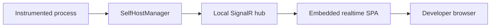

# Self-Hosted Diagnostics

> **Status: proposed design.** `DiagnosticExplorer.SelfHost` and the APIs described here have not been implemented yet. This document defines the intended package boundary, integration model, and acceptance criteria.

`DiagnosticExplorer.SelfHost` will let an instrumented application host a realtime diagnostics viewer for itself. Unlike the existing `DiagnosticService` mode, the application will not register with a central service or connect to another process. A developer opens a local browser URL to inspect the process that owns the viewer.

## When To Use It

Use self-hosting for local development, support investigations, or a focused single-process diagnostic view. Use `DiagnosticService` when multiple running applications must register with one viewer or when historical diagnostics are required.

| Capability | `DiagnosticService` | `DiagnosticExplorer.SelfHost` |
| --- | --- | --- |
| Processes shown | Many remote or local processes | One local process |
| Process selector | Yes | No |
| Realtime diagnostics | Yes | Yes |
| Property edits and operations | Yes | Yes |
| Event streaming | Yes | Yes |
| Retro diagnostics and persistence | Yes | No |
| Remote registration | Yes | No |

## Architecture



`SelfHostManager` is the boundary between the browser and the process. It uses `DiagnosticManager` directly to request diagnostic state, change properties, execute operations, and stream events. It presents one stable local process identity to every connected browser client.

The self-host package must not use `DiagnosticHostingService` or `RegistrationHandler`. It must not register with `DiagnosticService`, forward diagnostic messages, or persist Retro data.

## Package And Framework Support

The planned package is `DiagnosticExplorer.SelfHost` and targets `net6.0`, `net8.0`, and `net48`.

| Target | Standalone integration | Existing web-host integration | Server transport |
| --- | --- | --- | --- |
| `net6.0` | Yes | Yes, ASP.NET Core/Kestrel | ASP.NET Core SignalR |
| `net8.0` | Yes | Yes, ASP.NET Core/Kestrel | ASP.NET Core SignalR |
| `net48` | Yes | Not in the first release | OWIN and SignalR 2 |

A .NET Framework 4.8 application can use the ASP.NET Core SignalR *client*, but it cannot host an ASP.NET Core SignalR hub in-process. The `net48` package implementation will therefore use OWIN and SignalR 2 behind the same public self-host API.

ASP.NET Core SignalR and SignalR 2 have incompatible browser protocols. The realtime UI will share components and state models, but the package must carry a transport-specific SPA bundle for each server implementation.

## Typed .NET SignalR Clients

Use `TypedSignalR.Client` for .NET clients that connect to an ASP.NET Core SignalR hub. It generates strongly typed hub proxies and callback registrations from shared interfaces, replacing string-based `InvokeAsync` and `On` calls with compile-time checked methods.

`IDiagnosticHubServer` and `IDiagnosticHubClient` already use the required `Task` and `Task<T>` method shapes. `RegistrationHandler` should therefore replace its manual `HubServerAdapter` calls with a typed `IDiagnosticHubServer` proxy, and register an `IDiagnosticHubClient` receiver on the connection. The realtime-only self-host contracts should follow the same pattern for modern .NET integration tests and any .NET viewer clients.

This package applies only to the ASP.NET Core SignalR client protocol. The `net48` OWIN self-host branch uses SignalR 2 and needs its own adapter; `TypedSignalR.Client` does not bridge those incompatible server protocols.

## Planned API

The standalone API is intended for console applications, workers, Windows services, and WinForms applications that do not already own an HTTP listener:

```csharp
await using var diagnostics = await DiagnosticSelfHostingService.StartAsync(
    "http://127.0.0.1:1234");
```

`StartAsync` returns a host handle. Disposing it stops only the listener and diagnostic subscriptions created by the self-host package. Starting an equivalent listener twice must fail clearly; disposal and stop operations must be safe to repeat.

`SelfHostOptions` will configure the bind URI, path base, optional authentication or authorization integration, and optional SPA asset location. The default bind address must be loopback-only.

For applications that already own an ASP.NET Core pipeline, the package will provide registration and endpoint-mapping extensions instead of creating a second Kestrel server:

```csharp
builder.Services.AddDiagnosticSelfHost();

var app = builder.Build();
app.MapDiagnosticSelfHost("/diagnostics");
```

Mapping preserves ownership of the host application's URLs, startup and shutdown, authentication, CORS policy, routing, and fallback routes. The self-host middleware maps its assets and hub only beneath its configured path base.

## Browser Contract

The planned hub exposes only realtime operations:

- `Subscribe` and `Unsubscribe` for the one local process.
- `SetProperty` and `ExecuteOperation` for interactive diagnostics.
- Callbacks for diagnostic responses, response errors, initial events, and streamed events.

The browser client passes the local process ID for protocol consistency. The server validates that it is the single process exposed by this host and returns an `OperationResponse` error for another ID, invalid diagnostic paths, or invalid operation arguments.

The intended endpoint shape is scoped to the configured path base. With a path base of `/diagnostics`, the viewer is available at `/diagnostics/` and the hub at `/diagnostics/hub`. Consumers should use the viewer URL rather than relying on hub route details.

## Reusable Angular Viewer

`diag-web` will be divided into a reusable realtime viewer library and the existing multi-process service application.

The reusable library will contain diagnostic response/request contracts, process/category/event models, property and operation dialogs, category views, event views, event detail views, shared pipes, and tests. It receives a `RealtimeDiagnosticsTransport` abstraction rather than directly depending on a SignalR URL or implementation.

The following remain specific to the full `DiagnosticService` application:

- The registered-process list and route-based process selection.
- Multi-process state and navigation.
- All Retro search, persistence, and result components.
- The existing `/web-hub` transport adapter.

The self-host shell uses the same viewer library, supplies a fixed local process, and has no selector or Retro route. The package embeds its compiled SPA assets, so consuming applications do not install Node.js or build Angular files.

## Security And Exposure

The viewer can expose object state and invoke diagnostic operations. It is therefore a local development/support tool by default.

- Bind to loopback by default, such as `http://127.0.0.1:1234`.
- Do not bind to all network interfaces unless the caller explicitly chooses to do so.
- A non-loopback deployment must provide application-specific authentication, authorization, and transport security before exposing the viewer.
- Existing ASP.NET Core hosts retain their own authentication and CORS policy; the package must not add permissive global defaults.

## Implementation Plan

1. Create the multi-targeted `DiagnosticExplorer.SelfHost` package and move the unfinished self-host hub sketch out of `DiagnosticExplorer.Hosting`.
2. Extract the shared realtime hub contracts currently represented by `WebHub` and `IWebHubClient`; omit process-management and Retro members. Use `TypedSignalR.Client` proxies and receivers for modern .NET clients, sharing the generated contract interfaces between client and server.
3. Implement `SelfHostManager` with explicit subscription/disposal ownership and direct `DiagnosticManager` calls.
4. Add the ASP.NET Core standalone host, DI registration, and endpoint mapping integration for modern .NET targets.
5. Add an OWIN/SignalR 2 standalone implementation for `net48` using the same manager and public lifetime contract.
6. Extract the Angular realtime viewer behind a transport abstraction and produce modern-SignalR and SignalR-2 self-host bundles.
7. Embed the bundles and an asset manifest in the NuGet package. Cache hashed assets immutably and serve `index.html` without a long-lived cache.
8. Add console and WinForms samples, then update the root README to point to this guide.

## Verification

- Unit tests cover process identity, subscriptions, event streaming, property changes, operation execution, error responses, multiple browser clients, unsubscribe, disposal, and the absence of remote registration.
- ASP.NET Core integration tests verify standalone hosting, existing-Kestrel mapping under a path base, static assets, SPA fallback, and hub traffic.
- Windows net48 integration tests verify the OWIN/SignalR 2 host and matching SPA transport bundle.
- Compile the modern typed hub proxies and receivers against the shared contracts so contract drift fails at build time.
- Angular tests and production builds prove that the shared viewer works for both transports while the full service retains selector and Retro features.
- Package inspection verifies that all required embedded assets and manifests are present for each supported runtime.
- Manual smoke tests cover a plain console application, an existing Kestrel host, and a net48 WinForms application at loopback URLs.

## Related Code

- `DiagnosticExplorer.Hosting/DiagnosticHostingService.cs` provides lifecycle and local process-metadata patterns to reuse, but remains the remote-registration implementation.
- `DiagnosticExplorer.Hosting/SelfHost/SelfHostWebHub.cs` is an incomplete modern self-host sketch to migrate into the new package.
- `DiagnosticService/Hubs/WebHub.cs` and `DiagnosticService/Hubs/IWebHubClient.cs` define the current browser hub behavior from which the realtime-only contract will be extracted.
- `diag-web/src/app/services/diag-hub.service.ts` is the service-mode transport adapter that will be split from reusable realtime UI code.